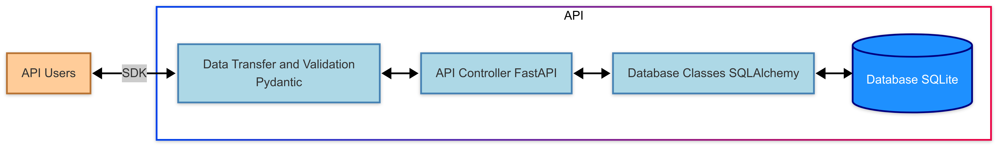

# Movie-Backend
Phase 1 du Projet CinéData

# Mission : **Construire un Écosystème Data Centré sur le Cinéma avec Python, FastAPI et Streamlit** 

**Contexte : Plongez dans l’univers du cinéma et de la Data Science**  

Une entreprise fictive, **CineData Insights** souhaite révolutionner l'expérience cinéphile grâce à une plateforme intelligente exploitant les données de films. Leur ambition : **Créer un système ultra-performant d'analyse de leurs données** à destination des plateformes de streaming, des cinéphiles et des studios de production.  

Mais il y a un problème... **Leurs données sont dans un état chaotique !** 
Elles sont éparpillées dans quelques fichiers CSV, rendant toute exploitation fastidieuse. Aucun système centralisé ne permet de requêter efficacement les informations sur les films, les notes attribuées par les utilisateurs ou encore les tags associés.  

C'est là que j'interviens en tant que **Consultant Data polyvalent / Ingénieur Data** ! Ma mission: Transformer ce chaos en un écosystème data performant et interactif. Je suis **le chef d’orchestre** de ce projet, portant successivement trois casquettes :  

---

## **Phase 1 : Développeur Python & Architecte API**  

**Objectif : Construire une API robuste pour centraliser et exposer les données MovieLens.**  

🔹 **Design de la base de données** :  
- Modéliser la base de données en SQL à partir des fichiers CSV.  
- Utiliser **SQLite** pour stocker les données de manière efficace.  
- Gérer les relations entre les films, les utilisateurs, les notes et les tags.  

🔹 **Développement de l’API avec FastAPI** :  
- Concevoir un **API RESTful** permettant d'interroger facilement les films et les notes des utilisateurs.  
- Intégrer **Pydantic** pour la validation des données entrantes.  
- Utiliser **SQLAlchemy** pour la gestion des requêtes à la base de données.  

🔹 **Déploiement de l’API** :  
- Héberger l’API sur un cloud public (**Render, AWS, Azure, GCP**).  
- Prévoir une version **on-premise** avec Docker.  
- Sécuriser les endpoints et optimiser les performances.  

🔹 **Création d’un SDK en Python** :  
- Développer un **package Python** permettant aux utilisateurs d'interagir facilement avec l’API.  
- Publier ce package sur **PyPI**, afin qu’il puisse être utilisé dans d'autres projets.  

**Livrables** :  
- Une base de données centralisée et prête à l’emploi.  
- Une API FastAPI documentée et déployée.  
- Un SDK Python simple d'utilisation et bien documenté

---

## **Phase 2 : Data Analyst - Exploration et Visualisation**  

**Objectif : Explorer et analyser les données en interrogeant l’API.**  

🔹 **Analyse Exploratoire des Données (EDA)** :  
- Utiliser le **SDK Python** pour requêter l’API et récupérer les données.  
- Identifier les tendances dans les notes des films.  
- Étudier les genres les plus populaires et les préférences des utilisateurs.  

🔹 **Construction d’une Data App avec Streamlit** :  
- Créer une **application interactive** qui permet de visualiser les tendances du cinéma.  
- Intégrer des **tableaux dynamiques** et des **graphiques interactifs**.  
- Offrir une **recherche avancée** des films en fonction des notes et des genres.  

**Livrables** :  
- Un notebook d'analyse exploratoire interactif.  
- Une **application web Streamlit** connectée à l’API qui présente, de manière interactive, les insights aux parties prenantes.

---
# Phase 1 : Développeur Python & Architecte API

# Conclusion – Phase 1 : Développeur Python & Architecte API

 Achever avec succès la **Phase 1** du parcours vers la maîtrise du développement backend en Python, avec un focus sur l’architecture d’API modernes. Cette étape  m'a permis de poser des fondations solides en conception de bases de données, en programmation orientée objet avec SQLAlchemy, en création d’API avec FastAPI, et en publication de SDK sur PyPI.

---

## Conçu la base de l'application de A à Z

-  **Conception de la base de données relationnelle** : j'ai conçu des tables et des relations métier (films, évaluations, tags...) en utilisant SQLite.
-  **Importation de données réelles** depuis des fichiers CSV (MovieLens) pour alimenter les tables.
-  **Écriture de requêtes SQL** pour extraire, manipuler et explorer les données stockées.

---

## mise en place la couche Data & ORM en Python

-  **Création de modèles SQLAlchemy** pour représenter les tables de la base dans le monde Python.
-  **Connexion à la base de données avec SQLAlchemy** et configuration d’une session propre pour exécuter les requêtes.
-  **Fonctions utilitaires (helpers)** permettant d’interagir efficacement avec la base de données (récupérer des films, ajouter une évaluation...).

---

## On a développé une API robuste avec FastAPI

-  **Création des endpoints d’API REST** pour exposer les données via HTTP.
-  **Utilisation de Pydantic** pour définir des schémas de validation et des objets de transfert de données (DTO).
-  **Tests des routes API** avec Swagger UI et ReDoc, grâce à la documentation interactive auto-générée de FastAPI.
-  **Tests en local**, dans un conteneur **Docker**, ou **déploiement en ligne** sur **Render**.

---

## On a produit un SDK Python pour interagir avec l’API

-  **Construction d’un SDK Python (`films_sdk_sbre`)** avec une interface claire pour interagir avec les endpoints exposés par l’API.
-  **Publication du SDK sur PyPI**, avec un `README.md` bien rédigé, respectant les normes de documentation.
-  **Tests du SDK publié** dans un nouveau projet, avec des appels simples en Python pour valider les fonctionnalités.
-  Le SDK est désormais accessible à toute la communauté Python, comme tout package professionnel.

---

## Compétences clés acquises

-  Conception de bases de données relationnelles
-  ORM avec SQLAlchemy
-  Architecture API RESTful avec FastAPI
-  Validation et typage fort avec Pydantic
-  Utilisation de Docker pour contenairiser votre application
-  Déploiement cloud sur Render
-  Génération de documentation API automatique (Swagger / Redoc)
-  Packaging Python, publication sur PyPI, gestion de versions
-  Création d’un SDK professionnel

---

## Et maintenant ?

Dans la **Phase 2 (Data Analyst)**, on changera de perspective.

On va **consommer des APIs**, extraire et analyser des données à l’aide de pandas, créer des visualisations et des tableaux de bord pour répondre à des questions métiers concrètes. Découvrir comment utiliser les données publiées par une API pour générer des **insights puissants**.

---

  
Jusque-là, je suis maintenant capable de **construire une API professionnelle de bout en bout et de créer un SDK réutilisable**.  
C’est exactement ce que font les développeurs dans des équipes tech modernes !

Passons à la Phase 2 : **Data Analyst – From API to Insight**.

--- 